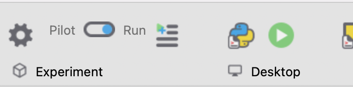

## Running the PsychoPy experiment

### 1. Download this repository

[Download this repository as a ZIP file](https://github.com/saeub/eyetracking-workshop/archive/refs/heads/main.zip) and extract its contents. Make sure you remember where the folder `eyetracking-workshop-main` is located on your file system.

### 2. Install PsychoPy

Download and install PsychoPy for your operating system (Windows, MacOS, or Linux) [here](https://psychopy.org/download.html). Make sure to select the **Standalone (Stable)** version, not the Studio (Beta) version.

### 3. Open the experiment

After the installation, PsychoPy should be available in your list of applications. Start PsychoPy and use `File > Open...` to open the experiment file `experiment.psyexp`, located under `eyetracking-workshop-main/experiment/psychopy`.

### 4. Run the experiment

Make sure that the switch in the toolbar is set to "Run" (not "Pilot"):

Then, click the green ▶️ button above "Desktop". After a few seconds, the experiment should start in full-screen mode.
